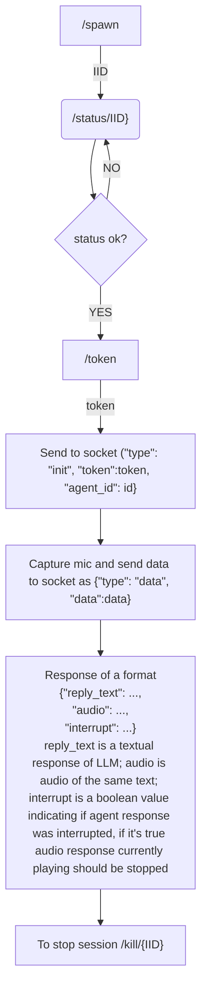

---

```mermaid
flowchart TD
    A["/spawn"] -->|IID| B("/status/IID}")
    B --> C{status ok?}
    C -->|NO| B
    C -->|YES| E["/token"]
    E -->|token| F["Send to socket (#quot;type#quot;: #quot;init#quot;, #quot;token#quot;:token, #quot;agent_id#quot;: id}"]
    F --> G["Capture mic and send data to socket as {#quot;type#quot;: #quot;data#quot;, #quot;data#quot;:data}"]
    G --> H["`Response of a format
    {#quot;reply_text#quot;: ...,
    #quot;audio#quot;: ...,
    #quot;interrupt#quot;: ...}
    reply_text is a textual response of LLM; audio is audio of the same text; interrupt is a boolean value indicating if agent response was interrupted, if it's true audio response currently playing should be stopped`"]
    H --> I["To stop session /kill/{IID}"]
```
---